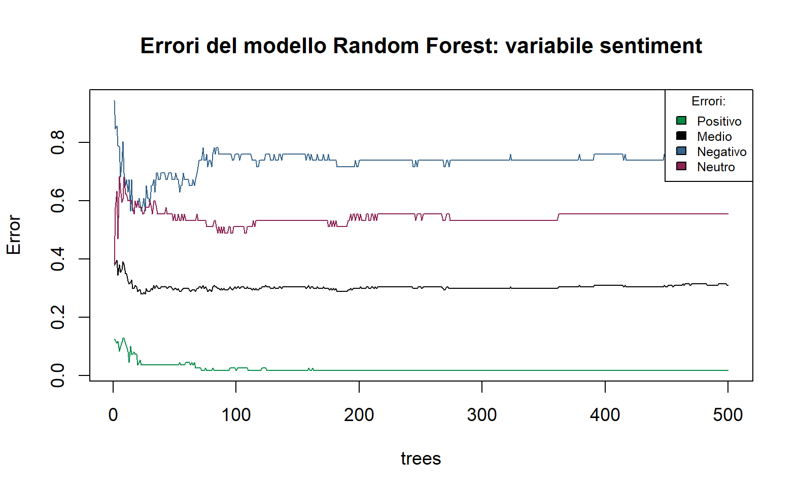
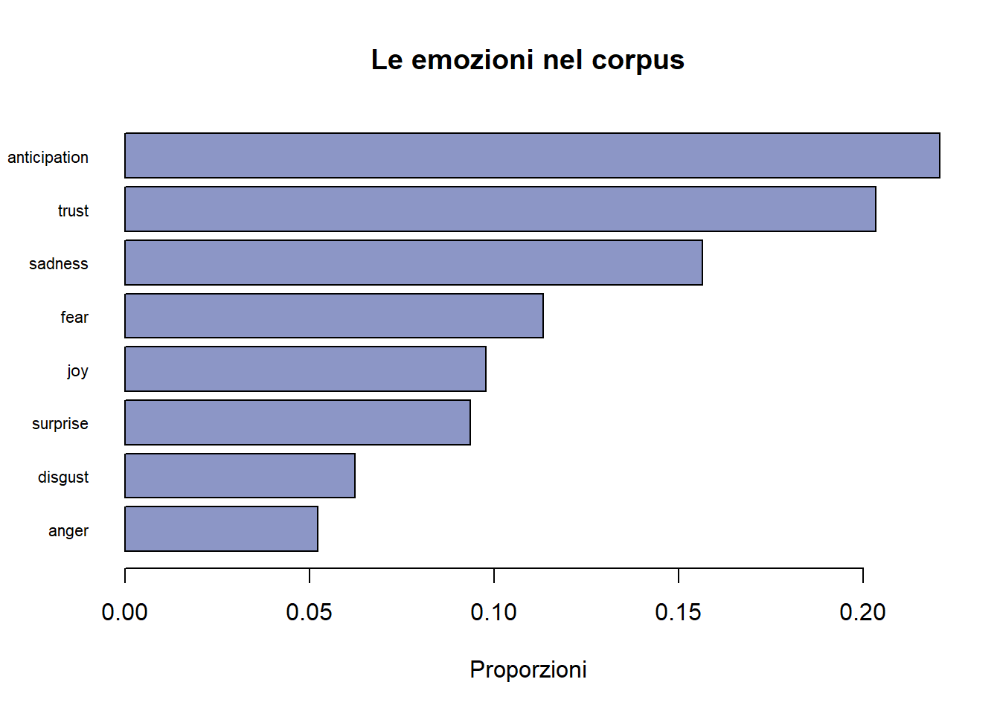

```{r setup, include=FALSE}
knitr::opts_chunk$set(warning = FALSE, message = FALSE) 
```

# 0. Overview

Abbiamo gestito il progetto attraverso Github. Questa è la repo.
<https://github.com/arct0r/R-Artigiani>

Ci è stato affidato il compito di individuare, tra tre negozi di
elettronica, quale fosse il migliore su cui investire attraverso una
serie di recensioni che i brand avevano raccolto.

Ci è stato fornito un dataset che contiene le seguenti variabili: 

- Social: le fonti delle recensioni; 

- Text: le recensioni; 

- Lang_value: lingua in cui è stata scritta; 

- Data_created_at: data di inserimento della recensione;

- Count_likes: numero dei like; 

- Score_Rating: una valutazione da 1 a 5; 

- Player: il negozio in questione

```{r echo=FALSE, results='hide',message=FALSE}

# LIBRERIE ----
# Dataset
library(readxl)
library(writexl)
# Directory
library(rstudioapi)
# Pre-processing
library(quanteda)
library(quanteda.textstats)
library(SnowballC) # stemming delle keywords
# Driver Analysis
library(dplyr)
library(syuzhet)
library(newsmap)
# Algoritmi
library(naivebayes)
library(randomForest)
library(iml)
library(future)
library(future.callr)
library(e1071)
library(reshape2)
library(cvTools)
library(caret)
# Grafici
library(ggplot2)
library(gridExtra)
library(quanteda.textplots)
# Tabelle
library(kableExtra)
library(flextable)
library(officer)

```

# 1. Dataset e Pulizia

```{r echo=FALSE, results='hide',message=FALSE}


# 1: DATASET E PULIZIA (Corpus, Dfm) ----

# Directory della cartella condivisa
setwd(dirname(getActiveDocumentContext()$path))
# Dataset
StoresReview <- read_excel("GRUPPO 3-4-5. Industry elettronica.xlsx")
# Aggiunta Primary key a sinistra del dataframe
StoresReview <- cbind(ID = seq(1:nrow(StoresReview)), StoresReview)

# Decidiamo di prendere in considerazione solo le recensioni in ITALIANO.

# Eliminiamo le recensioni vuote e manteniamo solo quelle in lingua italiana.
Ita_StoresReview <- StoresReview[(StoresReview$lang_value == "it" |
                                    is.na(StoresReview$lang_value) == TRUE) & 
                                   is.na(StoresReview$text) == FALSE,]
# Putroppo l'algoritmo di deeplearning ha assegnato valori in lang_value 
# diversi da it e NA anche a delle recensioni in italiano, quindi li elimina.

```

Il dataset sul quale dobbiamo effettuare analisi ha il seguente aspetto:

```{r echo=FALSE}
kbl(StoresReview[1:7, ], longtable = T, booktabs = T, 
    caption = "Dataset Negozi di Elettronica, Recensioni") %>%
    kable_styling(c("bordered", "condensed", "hover"), 
                  full_width = F, font_size = 11) %>%
    row_spec(0, color = "black", bold = T, background = "#b8daba") %>%
    column_spec(2, width = "20em", width_min="2in", color = "black" )
```

Le recensioni provengono da due fonti: places e twitter. Le lingue sono
molteplici e i negozi di elettronica (Player) sono 3.

```{r}
table(StoresReview$lang_value)
table(StoresReview$social, StoresReview$Player)
```
Nel dataset sono presenti testi vuoti:

```{r}
apply(StoresReview,2,function(x) sum(is.na(x)))
```

Le recensioni in italiano sono la maggioranza, decidiamo di prendere in considerazione solo quelle ed eliminiamo le altre. Il nostro dataset assume ora questo aspetto

```{r echo=FALSE}
kbl(Ita_StoresReview[1:7, ], longtable = T, booktabs = T, 
    caption = "Dataset Negozi di Elettronica, Recensioni") %>%
    kable_styling(c("bordered", "condensed", "hover"), 
                  full_width = F, font_size = 11) %>%
    row_spec(0, color = "black", bold = T, background = "#b8daba") %>%
    column_spec(2, width = "20em", width_min="2in", color = "black" )
```

Creiamo il corpus e la DFM togliendo le parole non utili (#hashtags, @usernames) provenienti dai tweets.

```{r}
# Creazione corpus
Corpus_Totale <- corpus(Ita_StoresReview)

# Creazione dfm
Dfm_Totale <- dfm(tokens(Corpus_Totale,
                         remove_punct = TRUE,
                         remove_symbols = TRUE,
                         remove_url = TRUE,
                         remove_numbers = TRUE) %>%
                    tokens_tolower() %>% 
                    tokens_remove(c(stopwords("italian"))) %>%
                    tokens_wordstem(language = "italian")) %>%
  dfm_trim(min_termfreq = 10,
           max_termfreq = 500, # Abbiamo messo un tetto per non considerare i 3 brand
           min_docfreq = 2)

# Raggruppiamo i tag e gli hashtag
Parole_Brutte <- colnames(Dfm_Totale)[grepl("^\\s*[#@]", trimws(colnames(Dfm_Totale)))]

# Li togliamo perché non ci saranno utili nell'analisi
Dfm_Totale <- Dfm_Totale[,!(colnames(Dfm_Totale) %in% Parole_Brutte)]

# check
dim(Dfm_Totale) # 3622 testi e 869 features

```

# 2. Analisi del sentiment con algoritmi supervisionati

Durante la fase di recensione manuale del sentiment ci siamo accorti che la maggior parte dei text proveniva da twitter, questi erano quasi tutti neutrali e non ci è sembrato che avessero particolare utilità.

Per questo motivo abbiamo deciso di creare un training data (n=200) composto all’80% da places e al 20% da tweets.


## 2.1 Preparazione dei dati per gli algoritmi

Procediamo con il campionamento casuale:

```{r}
set.seed(001) 
Training_places <- sample(Corpus_Totale[attr(Corpus_Totale, "docvars")$social == "places"],  size = 160,  replace = FALSE)
set.seed(002) 
Training_tweet <- sample(Corpus_Totale[attr(Corpus_Totale, "docvars")$social == "twitter"], size = 40, replace = FALSE)

```

```{r echo=FALSE, results='hide', message=FALSE}

# Corpus per l'analisi manuale
Training_Corpus <- c(Training_tweet, Training_places)

# Corpus per il TEST SET
Test_Corpus <- Corpus_Totale[!(Corpus_Totale %in% Training_Corpus)]

# Verifica se sono complementari
setequal(Corpus_Totale, union(Test_Corpus, Training_Corpus))
# Risposta affermativa, ma si nota una differenza di 22 testi

```
  
```{r}

# Dataframe del Campione per poterlo esportare
Campione <- data.frame(
  ID = attr(Training_Corpus, "docvars")$ID,
  persona <- rep(c("William","Davide","Maddalena","Giacomo"),each = 50),
  Training_Corpus,
  sentiment <- NA) # facilita le verifica dopo
names(Campione) <- c("ID","Persona","text","sentiment")
# Rinominazione necessaria per far riconoscere ad RStudio il text field

Campione <- read_excel("Training Data Grezzo.xlsx")

Campione$sentiment <- ifelse(Campione$sentiment == -1, "Negativo", 
                             ifelse(Campione$sentiment == 0, "Neutro", 
                                    "Positivo"))

```

``` {r echo=FALSE}

kbl(Campione[1:7, ], longtable = T, booktabs = T, 
    caption = "Analisi manuale") %>%
    kable_styling(c("bordered", "condensed", "hover"), 
                  full_width = F, font_size = 11) %>%
    row_spec(0, color = "black", bold = T, background = "#b8daba") %>%
    column_spec(2, width = "20em", width_min="2in", color = "black" )

```

```{r echo=FALSE, results='hide', message=FALSE}


# Verifica celle vuote.
apply(Campione, 2, function(x) sum(is.na(x)))
# Ogni recensione ha una valutazione

# Conversione in corpus con la variabile del sentiment
Training_Corpus <- corpus(Campione)

# Otteniamo le dfm per training e test "senza" trimming
Dfm_Training <- dfm(tokens(Training_Corpus,
                           remove_punct = TRUE,
                           remove_symbols = TRUE,
                           remove_url = TRUE,
                           remove_numbers = TRUE) %>%
                      tokens_tolower() %>% 
                      tokens_remove(c(stopwords("italian"))) %>%
                      tokens_wordstem(language = "italian")) %>%
  dfm_trim(max_termfreq = 500) # I Brand abbassavano l'accuracy

Dfm_Training <- Dfm_Training[,!(colnames(Dfm_Training) %in% Parole_Brutte)]


Dfm_Test <- dfm(tokens(Test_Corpus,
                       remove_punct = TRUE,
                       remove_symbols = TRUE,
                       remove_url = TRUE,
                       remove_numbers = TRUE) %>%
                  tokens_tolower() %>% 
                  tokens_remove(c(stopwords("italian"))) %>%
                  tokens_wordstem(language = "italian")) %>%
  dfm_trim(max_termfreq = 500)

Dfm_Test <- Dfm_Test[,!(colnames(Dfm_Test) %in% Parole_Brutte)]

```

Il numero delle features del training data e del testing data risultano le seguenti:

``` {r}

length(Dfm_Training@Dimnames$features) #1235
length(Dfm_Test@Dimnames$features) #8533

# Abbasso il numero di features del test
Dfm_Test <- dfm_match(Dfm_Test, 
                      features = featnames(Dfm_Training))
# Dopo il match lunghezzze pari a 1235

```

``` {r echo=FALSE}
# Verifica
setequal(featnames(Dfm_Training), 
         featnames(Dfm_Test))

# Creazione matrici per gli algoritmi
Matrice_Training <- as.matrix(Dfm_Training)
Matrice_Test <- as.matrix(Dfm_Test)

# Conversione del vettore sentiment in factor
Dfm_Training@docvars$sentiment <- as.factor(Dfm_Training@docvars$sentiment)

```

## 2.2 Training e classificazione

Cominciamo creando ed allenando l'algoritmo di Bayes:

```{r}

# ALGORITMO NAIVE BAYES
set.seed(123)
NaiveBayesModel <- multinomial_naive_bayes(x=Matrice_Training,
                                           y=Dfm_Training@docvars$sentiment,
                                           laplace = 1)
# Distribuzione del sentiment sul training
summary(NaiveBayesModel)

```

Procediamo con la predizione usando l'algoritmo (di Bayes) appena allenato.

``` {r}

# Predizione sul test set
Test_predictedNB <- predict(NaiveBayesModel,
                            Matrice_Test)

# frequenze assolute sui 3400 testi del test
table(Test_predictedNB)
```

Iniziamo il primo training del random forest con 500 trees.

```{r}

# ALGORITMO RANDOM FOREST
set.seed(150)
RF <- randomForest(y= Dfm_Training@docvars$sentiment,
                   x= Matrice_Training,
                   importance=TRUE,
                   do.trace=FALSE,
                   ntree=500) # numero standard
RF # Error rate: 31%

```



Identifichiamo il numero di trees minimi che commettono l'errore minore.

```{r}
# Salvo tutti gli errori relativi al numero dei trees
Errori <- as.data.frame(RF$err.rate)

# Identifico il PRIMO numero di ntrees con l'errore minimo
which.min(Errori$OOB) # 23

```

Sperimentiamo riallenando il Random Forest con 23 trees. 

``` {r}
# Rifacciamo con ntree = 23
set.seed(150)
RF <- randomForest(y= Dfm_Training@docvars$sentiment,
                   x= Matrice_Training,
                   importance=TRUE,
                   do.trace=FALSE,
                   ntree=23)
RF # 28% error rate

```

Ripetiamo la predizione.

``` {r}

Test_predictedRF <- predict(RF, Matrice_Test ,type="class")

table(Test_predictedRF)

```

Ora creiamo ed allenaniamo il Support Vector Machine.

``` {r}

# SUPPORT VECTOR
set.seed(175)
SupportVectorMachine <- svm(
  y= Dfm_Training@docvars$sentiment,
  x=Matrice_Training, kernel='linear', cost = 1)

length(SupportVectorMachine$index) # 173 support vector

```

Predizioni del Support Vector Machine:

``` {r}
Test_predictedSV <- predict(SupportVectorMachine, Matrice_Test)

table(Test_predictedSV)

```

Abbiamo allenato 3 diversi algoritmi sul nostro training data con il sentiment recensito manualmente.
Bayes, Random Forest e Support Vector Machine. 

Questo è un sample del loro risultato. In seguito analizzeremo più a fondo le loro performances attraverso il processo di cross validation.

```{r}


# frequenze relative dei diversi algoritmi
results <- as.data.frame(rbind(prop.table(table(Test_predictedNB)),
                               prop.table(table(Test_predictedRF)),
                               prop.table(table(Test_predictedSV))))

results$algorithm <- c("Naive Bayes", "Random Forest", "Support Vector Machine")

df.long<-melt(results,id.vars=c("algorithm"))

```


```{r echo=FALSE}

# Grafico che compara i risultati dei tre algoritmi
ggplot(df.long,aes(algorithm,value,fill=variable))+
  geom_bar(position="dodge",stat="identity") + scale_fill_manual(values = c("red", "yellow2", "darkgreen")) +
  labs(title = "Comparazione delle predizioni") +
  theme(axis.text.x = element_text(color="#993333", angle=90)) + coord_flip() +
  ylab(label="Proporzione delle categorie nel test set") + xlab("Algoritmi") +
  guides(fill=guide_legend(title="Categorie di \nsentiment")) +
  theme(plot.title = element_text(color = "black", size = 12, face = "plain"),
        axis.title=element_text(size=11,face="plain"),
        axis.text= element_text(size =10, face = "italic")
  )

```

Wow! Che sta succedendo qui? I nostri algoritmi stanno dando valutazioni
completamente diverse! Quale sarà il migliore?

## 2.3 Cross validation

Per la cross validation abbiamo scelto un numero di subset pari a 5 (k=5).

Misuriamo l'accuracy ed f1 score dei tre algoritmi:

```{r echo=FALSE, results='hide', message=FALSE}

# Abbiamo i tre risultati, capiamo quale algoritmo performa meglio

Matrice_Training2 <- Matrice_Training

 
set.seed(200)
k <- 5
folds <- cvFolds(NROW(Matrice_Training2), K = k)

for(i in 1:k){
  Matrice_Training <-
    Matrice_Training2 [folds$subsets[folds$which != i], ]
  ValidationSet <-
    Matrice_Training2 [folds$subsets[folds$which == i], ]
  set.seed(200)
  NaiveBayesModel <- multinomial_naive_bayes(
    y= Dfm_Training[folds$subsets[folds$which != i], ]
    @docvars$sentiment ,
    x=Matrice_Training, laplace = 1)
  Predictions_NB <- predict(NaiveBayesModel, 
                            newdata = ValidationSet, 
                            type = "class")
  class_table <- table("Predictions"= Predictions_NB,
                       
                       "Actual"=Dfm_Training[folds$subsets[folds$which == i], ]@docvars$sentiment)
  
  df<-confusionMatrix( class_table, mode = "everything")
  df_measures_NB<-paste0("conf.mat.nb",i)
  assign(df_measures_NB,df)
}

NB_Prediction <- data.frame(col1=vector(), col2=vector(), col3=vector(), col4=vector())

#Riempiamo il dataset con i valori di accuracy e f1 
for(i in mget(ls(pattern = "conf.mat.nb")) ) {
  Accuracy <-(i)$overall[1]
  p <- as.data.frame((i)$byClass)
  F1_negative <- p$F1[1]
  F1_neutral <- p$F1[2]
  F1_positive <- p$F1[3]
  NB_Prediction <- rbind(NB_Prediction , cbind(Accuracy , F1_negative ,
                                               F1_neutral, F1_positive ))
  
}

# str(NB_Prediction) # Si nota la presenza di NA
NB_Prediction [is.na(NB_Prediction )] <- 0

AverageAccuracy_NB <- mean(NB_Prediction[, 1] )
AverageF1_NB<- mean(colMeans(NB_Prediction[-1] ))

```


```{r}

# ACCURACY BAYES
AverageAccuracy_NB # 81,5%
AverageF1_NB # 72,7%

```

**Wow!!!!!!!!!!!!** 81%. Un risultato strabiliante.

```{r echo=FALSE, results='hide', message=FALSE}

# RANDOM FOREST
for(i in 1:k){
  Matrice_Training <-
    Matrice_Training2 [folds$subsets[folds$which != i], ]
  ValidationSet <-
    Matrice_Training2 [folds$subsets[folds$which == i], ]
  set.seed(250)
  RandomForest <- randomForest(
    y= Dfm_Training[folds$subsets[folds$which != i], ]
    @docvars$sentiment ,
    x=Matrice_Training, do.trace=FALSE, ntree=23)
  Predictions_RF <- predict(RandomForest, 
                            newdata= ValidationSet, 
                            type="class")
  class_table <- table("Predictions"= Predictions_RF,
                       "Actual"=Dfm_Training[folds$subsets[folds$which == i], ]@docvars$sentiment)
  df<-confusionMatrix( class_table, mode = "everything")
  df_measures_RF<-paste0("conf.mat.rf",i)
  assign(df_measures_RF,df)
}

RF_Predictions <- data.frame(col1=vector(), col2=vector(), col3=vector(), col4 = vector())


for(i in mget(ls(pattern = "conf.mat.rf")) ) {
  Accuracy <-(i)$overall[1]
  p <- as.data.frame((i)$byClass)
  F1_negative <- p$F1[1]
  F1_neutral <- p$F1[2]
  F1_positive <- p$F1[3]
  RF_Predictions <- rbind(RF_Predictions , cbind(Accuracy , F1_negative ,
                                                 F1_neutral, F1_positive ))
  
}

# str(RF_Predictions) # Presenza NA
RF_Predictions [is.na(RF_Predictions )] <- 0


AverageAccuracy_RF <- mean(RF_Predictions[, 1] )
AverageF1_RF<- mean(colMeans(RF_Predictions[-1] ))

```

Nonostante abbiamo diminuito il numero di trees l'accuracy risulta
inferiore rispetto a Bayes.

```{r}

# ACCURACY RANDOM FOREST
AverageAccuracy_RF # 67,5%
AverageF1_RF  #52,6%

```

```{r echo=FALSE, results='hide', message=FALSE}

# SUPPORT VECTOR MACHINE
for(i in 1:k){
  Matrice_Training <-
    Matrice_Training2 [folds$subsets[folds$which != i], ]
  ValidationSet <-
    Matrice_Training2 [folds$subsets[folds$which == i], ]
  set.seed(300)
  SupportVectorMachine<- svm(
    y= Dfm_Training[folds$subsets[folds$which != i], ]
    @docvars$sentiment, 
    x=Matrice_Training, kernel='linear', cost = 1)
  Prediction_SVM <- predict(SupportVectorMachine,
                            newdata=ValidationSet)
  class_table <- table("Predictions"= Prediction_SVM,
                       "Actual"=Dfm_Training[folds$subsets[folds$which == i], ]@docvars$sentiment)
  df<-confusionMatrix( class_table, mode = "everything")
  df_measures_SVM<-paste0("conf.mat.sv",i)
  assign(df_measures_SVM,df)
}


SVM_Prediction <- data.frame(col1=vector(), col2=vector(), col3=vector(), col4=vector())

#Riempiamo il dataframe 
for(i in mget(ls(pattern = "conf.mat.sv")) ) {
  Accuracy <-(i)$overall[1]
  p <- as.data.frame((i)$byClass)
  F1_negative <- p$F1[1]
  F1_neutral <- p$F1[2]
  F1_positive <- p$F1[3]
  SVM_Prediction <- rbind(SVM_Prediction , cbind(Accuracy , F1_negative ,
                                                 F1_neutral, F1_positive ))
  
}

# str(SVM_Prediction) # Presenza NA
SVM_Prediction [is.na(SVM_Prediction)] <- 0


#Calcoliamo i valori medi
AverageAccuracy_SVM <- mean(SVM_Prediction[, 1] )
AverageF1_SVM<- mean(colMeans(SVM_Prediction[-1] ))

```


```{r}


# ACCURACY SUPPORT VECTOR MACHINE
AverageAccuracy_SVM # 73%
AverageF1_SVM # 62,2%

```

```{r echo=FALSE, results='hide', message=FALSE}

# CONFRONTO
AccNB <- as.data.frame(AverageAccuracy_NB )
colnames(AccNB)[1] <- "NB"

#Creo un dataframe per RF
AccRF <- as.data.frame(AverageAccuracy_RF )
#Rinomino la colonna
colnames(AccRF)[1] <- "RF"

#Creo un dataframe per SVM
AccSVM<- as.data.frame(AverageAccuracy_SVM )
#Rinomino la colonna
colnames(AccSVM)[1] <- "SVM"

#Unisco in un unico dataframe i valori di accuracy dei tre modelli
Accuracy_models <- cbind(AccNB, AccRF, AccSVM)

# Accuracy Bayes superiore

Accuracy_models_Melt <-melt(Accuracy_models)

# Si salva il primo grafico per il gird arrange
plot_accuracy <- ggplot(Accuracy_models_Melt, aes(x=variable, y=value, color = variable)) +
  geom_boxplot() + xlab("Algorithm") + ylab(label="Values of accuracy") +
  labs(title = "Cross-validation with k =5: values of accuracy") + coord_flip() +
  theme_bw() +
  guides(color=guide_legend(title="Algorithms")) +
  theme(plot.title = element_text(color = "black", size = 12, face = "italic"),
        axis.title.x =element_text(size=12,face="bold"),
        axis.title.y =element_text(size=12, face = "plain"),
        axis.text= element_text(size =10, face = "italic")
  )

F1NB <- as.data.frame(AverageF1_NB)
colnames(F1NB)[1] <- "NB"
#RF
F1RF<- as.data.frame(AverageF1_RF )
colnames(F1RF)[1] <- "RF"
#SVM
F1SVM <- as.data.frame(AverageF1_SVM)
colnames(F1SVM)[1] <- "SVM"
#DATAFRAME
f1_models <- cbind(F1NB, F1RF, F1SVM)
# F1 score di Bayes superiore

f1_models_melt <-melt(f1_models)
# str(f1_models_melt)

# Si salva il secondo grafico
plot_f1 <- ggplot(f1_models_melt, aes(x=variable, y=value, color = variable)) +
  geom_boxplot() + xlab("Algorithm") + ylab(label="Values of f1") +
  labs(title = "Cross-validation with k =5: values of f1") + coord_flip() +
  theme_bw() +
  guides(color=guide_legend(title="Algorithms")) +
  theme(plot.title = element_text(color = "black", size = 12, face = "italic"),
        axis.title.x =element_text(size=12,face="bold"),
        axis.title.y =element_text(size=12, face = "plain"),
        axis.text= element_text(size =10, face = "italic")
  )

```

```{r}


grid.arrange(plot_accuracy, plot_f1, nrow=2) #bayes

```

Determiniamo così che Bayes è l’algoritmo più performante


```{r echo=FALSE, results='hide', message=FALSE}


# Creo dataframe che salva le predizioni dei tre algoritmi.
Esiti_algo_Test <- data.frame(
  ID = attr(Test_Corpus, "docvars")$ID,
  social = attr(Test_Corpus, "docvars")$social,
  text = Test_Corpus,
  Bayes = Test_predictedNB,
  RF = Test_predictedRF,
  SVM = Test_predictedSV
)

# Risultati dell'algoritmo vincitore 
Df_sentiment <- data.frame(
  ID = c(Training_Corpus$ID, Test_Corpus$ID),
  NB_sentiment = c(Campione$sentiment, as.vector(Test_predictedNB))
)

# Mettiamo il sentiment nel dataframe di partenza
Ita_StoresReview <- merge(Ita_StoresReview, Df_sentiment, by='ID')

```

## 2.4 AAP (Actual Algorythm Performance)

Il test che è stato creato per valutare le prestazioni degli algoritmi sul set di dati di testing è conosciuto come cross validation. Grazie a questa tecnica, siamo in grado di comprendere come gli algoritmi si comportino con il set di dati di addestramento. 

Tuttavia, non abbiamo informazioni sull'accuratezza degli algoritmi con il set di dati di testing. Pertanto, è stato ideato l'AAP (Actual Algorithm Performances).

Abbiamo estratto un campione di testi (60 testi) dal testing data e li abbiamo recensiti manualmente. Abbiamo posizionato queste recensioni di fianco a quelle degli algoritmi.

Abbiamo infine calcolato l`accuracy di tutti e tre gli algoritmi in questo campione. Queste sono state le performances:


```{r echo=FALSE, results='hide', message=FALSE}

# Abbiamo voluto campionare una sessantina di testi nel test set
# per rifare l'analisi manuale e fare una stima dell'accuratezza dei tre algoritmi
set.seed(007)
AAP_test_data_places <- Esiti_algo_Test %>%
  filter(social == 'places') %>%
  slice_sample(n=40, replace = FALSE)
# Con questo codice estraggo 40 random samples dal testing data con social == places

set.seed(007)
AAP_test_data_twitter <- Esiti_algo_Test %>%
  filter(social == 'twitter') %>%
  slice_sample(n=20, replace = FALSE)

# Faremo il bind manuale su excel
#write_xlsx(AAP_test_data_places, 'aap_sample_places.xlsx')
#write_xlsx(AAP_test_data_twitter, 'aap_sample_twitter.xlsx')

AAP_test_data <- read_excel("aap_reviewed.xlsx")
AAP_test_data$human_val <- ifelse(AAP_test_data$human_val  == -1, "Negativo", 
                                  ifelse(AAP_test_data$human_val  == 0, "Neutro", 
                                         "Positivo"))

AAP_confronto <- c(Bayes = sum(AAP_test_data$Test_predictedNB == AAP_test_data$human_val),
                   RF = sum(AAP_test_data$Test_predictedRF == AAP_test_data$human_val),
                   SV = sum(AAP_test_data$Test_predictedSV == AAP_test_data$human_val))

# Dataframe che contiene freq assoluta e relativa sull'analisi manuale effettuata sul campione del test set.
AAP_confronto <- data.frame(
  Bayes = c(sum(AAP_test_data$Test_predictedNB == AAP_test_data$human_val),
            sum(AAP_test_data$Test_predictedNB == AAP_test_data$human_val)/60*100),
  
  RF = c(sum(AAP_test_data$Test_predictedRF == AAP_test_data$human_val),
         sum(AAP_test_data$Test_predictedRF == AAP_test_data$human_val)/60*100),
  
  SV = c(sum(AAP_test_data$Test_predictedSV == AAP_test_data$human_val),
         sum(AAP_test_data$Test_predictedSV == AAP_test_data$human_val)/60*100)
)
rownames(AAP_confronto) <- c("Freq Assoluta", "Freq Relativa")
```

```{r echo=FALSE}

kbl(AAP_test_data[1:7, ], longtable = T, booktabs = T, 
    caption = "Dataset Negozi di Elettronica, Recensioni") %>%
    kable_styling(c("bordered", "condensed", "hover"), 
                  full_width = F, font_size = 11) %>%
    row_spec(0, color = "black", bold = T, background = "#b8daba") %>%
    column_spec(2, width = "20em", width_min="2in", color = "black" )

```

Abbiamo infine calcolato l'accuracy di tutti e tre gli algoritmi in
questo campione. Queste sono state le performances:

```{r}

round(AAP_confronto[2,],2)

```

Rispetto alla cross validation Bayes rimane il piu’ performante ma ha comunque registrato un calo di prestazioni.

Essendo la stragrande maggioranza dei tweets inutili sarebbe interessante capire come il quantitativo di questi nel campione influenza l’accuracy.

# 3. Driver Analysis

Frequenze delle caratteristiche del Corpus

```{r}
# Frequenze delle caratteristiche del Corpus
apply(textstat_summary(Corpus_Totale)[,2:11], 2, sum)
```

Notiamo la presenza di emoji, tag, urls e altri elementi disturbanti per
l'analisi.

Abbiamo voluto prendere in considerazione solo le recensioni di places per individuare i possibili driver del dataset.

```{r}
# Abbiamo voluto prendere in considerazione solo le recensioni di places
# per individuare i possibili driver del dataset.
Dfm_Places <- dfm(tokens(Corpus_Totale[attr(Corpus_Totale, "docvars")$social == "places"],
                         remove_punct = TRUE,
                         remove_symbols = TRUE,
                         remove_url = TRUE,
                         remove_numbers = TRUE) %>%
                    tokens_tolower() %>% 
                    tokens_remove(c(stopwords("italian"))) %>%
                    tokens_wordstem(language = "italian")) %>%
  dfm_trim(min_termfreq = 10,
           max_termfreq = 500, # Abbiamo messo un tetto per non considerare i 3 brand
           min_docfreq = 2)

```

RILEVAZIONE DELLE KEYWORDS

```{r}
# Vogliamo rappresentare le top 50 sui grafici
Parole_Popolari <- textstat_frequency(Dfm_Places, n =50)
Parole_Popolari$feature <- with(Parole_Popolari, reorder(feature, frequency))

```

```{r echo=FALSE}
ggplot(Parole_Popolari, aes(x=frequency, y=feature)) +
 geom_point(size = 1.5, color = "Darkorange2") +
  theme_bw() +
theme(axis.text.x = element_text(angle=360, hjust=1)) +
labs(x = "Frequenza", y = "Features", 
      title = "Le 50 parole più frequenti nelle recensioni") +
  theme(plot.title = element_text(color = "Darkorange2", size = 11, face = "bold"),
        plot.subtitle = element_text(color = "black", size = 11, face = "italic" ))

```

```{r echo=FALSE, message=FALSE}

textplot_wordcloud(Dfm_Places, 
                  min_size = 1.5,  
                  max_size = 4,    
                   min.count = 10,   
                   max_words = 50,  
                   random.order = FALSE,  
                   random_color = FALSE,
                   rotation = 0,    #rotazione delle parole
                   colors = RColorBrewer::brewer.pal(8,"Dark2"))
```

## 3.1 Scelta delle Keywords e Driver

Abbiamo individuato 4 possibili driver: Prezzo, Servizio, Ordini e Location.

Le seguenti keywords sono state in parte generate ed in parte scelte dalla lista di features. Verranno utilizzate sia per il dizionario che per l'algoritmo supervisionato.


```{r}

Driver <- dictionary(list(prezzo = c("promozione", "risparmio", "qualità", "prezzo", "economicità", 
                                     "economico", "concorrenziali", "sconto", 
                                     "offerta", "budget", "ragionevole","costo", "sostenibile", 
                                     "convenienti", "sottocosto", "eccezional", "super", "miglior", "ben", 
                                     "top", "futur", "offert", "convenient", "risparm", "assurd", "super", "pazzesc", "gratis"),
                          servizio =  c("rapidità", "Empatia", "professionale", "supporto", 
                                        "risoluzione","problemi",  "cordialità", "assistenza", "vendita", 
                                        "immediata", "efficienza", "cortese", "reclami", 
                                        "competenza", "cliente", "flessibilità", "tempestività", 
                                        "servizio", "accoglienza", "caloroso", "gentile", "personal", "competente", "disponibile", "male",
                                        "lento", "disorganizzato", "disordinato", "scortese", "cafone", "garanzia", "reso", "account",
                                        "signor", "reparto", "richiest", "graz", "eccezional", "inform", "miglior", "ragazz",
                                        "rispost", "gent", "gentilissim", "rispett", "competent", "bell", "ringraz", "aiut",
                                        "pront", "addett", "pessim", "pazienz", "ore", "benissim", "purtropp", "purtropp", "problem",
                                        "incompetent", "rivolg", "compl", "ben", "consigl", "prossim", "buon", "gentilezz", "educ",
                                        "simpat", "dispon", "attenzion", "qualif", "aspett", "grandissim", "disponibil", "esigent", "top",
                                        "giovan", "assist", "futur", "risolt", "bravissim", "commess", "brav", "spieg", "dubb", "vergogn",
                                        "inutil", "maleduc", "pochissim", "signorin", "bellissim", "perfett", "attent", "super",
                                        "pazzesc", "soluzion", "difett", "truff", "qualit", "normal", "scortes", "intelligent"),
                          ordini = c("transazione", "acquisto", "pagamento", "tempo", "consegna", 
                                     "ordine", "opzioni", "modalità", "ritiro", 
                                     "rimborso", "conferma", "tracciabilità", "facilità", 
                                     "catalogo", "online","checkout", "garanzia", "reso", "account", "bell", "pessim", "nuov",
                                     "benissim", "purtropp", "problem", "ben", "buon", "aspett", "attesa", "top", "futur", "risolt",
                                     "vergogn", "inutil", "bellissim", "assurd", "super", "difett", "truff"),
                          location = c("accesso", "facilitato", "ampio", "parcheggio", "zona", "geografica", 
                                       "ambiente", "accogliente", "strutture", "moderne",
                                       "punto", "vendita", "facilità", "raggiungimento", "accessibilità", "disabili", 
                                       "prossimità","area", "centrale", "sicurezza", "atmosfera", "piacevole", "posizione","strategica", 
                                       "illuminata", "spazio", "facile", 
                                       "tranquilla", "negozio", "posto", "affollato", "piccolo", "disordinato", "bell", "ben")))

```

Questi sono i numeri di features per ogni categoria.

- Prezzo: 27
- Servizio: 101
- Ordini: 39
- Location: 35


Abbiamo applicato lo stemming alle keywords.

``` {r}
# Funzione che applicherà lo stemming sulle keywords del driver
stem_words <- function(words) {
  stemmed_words <- wordStem(words, language = "italian")
  return(stemmed_words)
}

```

```{r echo=FALSE, results='hide',message=FALSE}

Driver$prezzo <- stem_words(Driver$prezzo)
Driver$servizio <- stem_words(Driver$servizio)
Driver$ordini <- stem_words(Driver$ordini)
Driver$location <- stem_words(Driver$location)

Driver_Review <- dfm_lookup(Dfm_Totale,Driver)

```

```{r}

Driver_Conv_Rev <- convert(Driver_Review, to = "data.frame")
Driver_Conv_Rev <- cbind(ID = Dfm_Totale@docvars$ID, Driver_Conv_Rev)

apply(Driver_Conv_Rev[,3:6],2,sum) # Numero di testi etichettati per driver
prop.table(apply(Driver_Conv_Rev[,3:6],2,sum)) # Distribuzione dei driver


DriverAnalysis <- full_join(Ita_StoresReview, Driver_Conv_Rev)

```

## 3.2 Sentiment Analysis

Mettiamo a confronto attraverso un grafico sentiment e rating, i sentiment "positivo" “negativo” vengono messi in relazione con ogni livello del rating

```{r}

Dizionario <- get_sentiment_dictionary(dictionary = 'nrc', 
                                       language = "italian")

Store_reviews_sentiment <- get_sentiment(Corpus_Totale,
                                                      method = 'nrc', language = "italian")

DriverAnalysis$sentimentAnalysis <- Store_reviews_sentiment

DriverAnalysis$sentiment_labels <- ifelse(DriverAnalysis$sentimentAnalysis <= 0, "Negativo", "Positivo")
```


```{r echo=FALSE}
# Grafico che dati i 5 livelli di rating mostra la suddivisione nel sentiment
RatingXsentiment <- table(DriverAnalysis$sentiment_labels, DriverAnalysis$score_rating)
RatingXsentiment <- as.data.frame(RatingXsentiment)
colnames(RatingXsentiment) <- c("Sentiment","Rating","Freq")
```


```{r echo=FALSE}

ggplot(RatingXsentiment,aes(Rating, Freq, fill=Sentiment))+
  geom_bar(position="stack",stat="identity") +   
  scale_fill_manual(values = c("#CA3432", "darkseagreen")) +
  labs(title = "Sentiment rispetto al rating") +
  theme(axis.text.x = element_text(color="#993333", angle=90)) + 
  coord_flip() +
  ylab(label="Frequenza assoluta") + 
  xlab("Rating") +
  guides(fill=guide_legend(title="Sentiment:")) +
  theme(plot.title = element_text(color = "black", size = 12, face = "plain"),
        plot.subtitle = element_text(face = "plain"),
        axis.title=element_text(size=10,face="plain"),
        axis.text= element_text(size =10, face = "italic"))

```

## 3.3 Emotion Analysis

```{r echo=FALSE}

# EmotionAnalysis <- get_nrc_sentiment(Corpus_Totale)

# Grafico che mostra le emozioni rilevate e la loro distribuzione
#barplot(
 # sort(colSums(prop.table(EmotionAnalysis[, 1:8]))), 
  #horiz = TRUE, 
  #cex.names = 0.7, 
  #las = 1, 
  #main = "Le emozioni nel corpus", xlab="Proporzioni",
  #col = "#8C96C6"
#)


```

Con un grafico osserviamo come, in proporzione, le varie emozioni si presentano nelle recensioni.



## 3.4 Newsmap

Seconda parte dell’analisi, qui lavoriamo con l’algoritmo semi supervisionato.

```{r echo=FALSE, results='hide',message=FALSE}

DriverAnalysis_SemiSupervisedApproach <- dfm(tokens(Corpus_Totale,
                         remove_punct = TRUE,
                         remove_symbols = TRUE,
                         remove_url = TRUE,
                         remove_numbers = TRUE) %>%
                           tokens_tolower() %>%
                           tokens_wordstem(language = "italian") %>%
                           tokens_lookup(dictionary = Driver))

TextModel <- textmodel_newsmap(Dfm_Totale,
                               DriverAnalysis_SemiSupervisedApproach)

DriverAnalysis$SemiSupervised <- predict(TextModel)

```

```{r}
round(prop.table(table(predict(TextModel))), 2)*100 # % driver nel dataset

```


```{r}
DriverAnalysis$Dizionario <- ifelse(DriverAnalysis$prezzo > 0, "Prezzo",
                                    ifelse(DriverAnalysis$servizio > 0, "Servizio",
                                           ifelse(DriverAnalysis$ordini > 0, "Ordini",
                                                  ifelse(DriverAnalysis$location > 0, "Location", "NA"))))

ConfrontoRisultati <- filter(DriverAnalysis, Dizionario == "NA")
# Colonna inutile 
DriverAnalysis$doc_id <- NULL
```

# 4. Conclusioni e considerazioni

Vogliamo basarci sui risultati dell'algoritmo semi-supervisionato, ma si nota la presenza di NA nelle colonne Player e del semi-supervisionato.

```{r}
apply(DriverAnalysis, 2, function(x) sum(is.na(x)))
```

```{r echo=FALSE}
DriverAnalysis <- DriverAnalysis[is.na(DriverAnalysis$SemiSupervised) == FALSE &
                                   is.na(DriverAnalysis$Player) == FALSE,]
```

## 4.1 Conclusioni generali

Per interpretare i dati procediamo con la creazione di grafici che ci permettano di vedere nel dettaglio sentiment, rating e driver.

In questa tabella visualizziamo i valori medi di rating e sentiment nei tre brand, inseriamo anche il numero totale di recensioni. Scegliamo di assegnare il livello di intensità colore in base al peso del valore.


```{r}

# TABELLA GENERALE
# Recensioni, rating e sentiment in base al brand
Generale <- DriverAnalysis %>%
  group_by(Player) %>%
  summarise(n_rec = length(text),
            media_rating = round(mean(score_rating,na.rm = TRUE),2),
            media_sentiment = round(mean(sentimentAnalysis),2))

# Pre ottenere una tabella a colori abbiamo usato una funzione alternativa
Generale_ft <- flextable(Generale)

Generale_ft |>
  bg(j = c("media_rating","media_sentiment"), 
     bg = scales::col_quantile(palette = c("wheat", "red"), domain =NULL))
# Colora in base al peso del valore

```

Notiamo che il brand con il rating più alto è Euronics, che supera di poco Mediaworld, Mediaworld però ha una media di sentiment decisamente più alta, probabilmente il fatto che il numero di recensioni di Euronics sia più basso va ad impattare sulla media del rating.

Creiamo poi un grafico che mostra in che modo si distribuisce il sentiment nei tre brand nel dettaglio. Mediaworld ha i valori di positivi più alti.


```{r echo=FALSE}
# DISTRIBUZIONE SENTIMENT PER BRAND
Brand_sentiment <- as.data.frame(table(Ita_StoresReview$Player, Ita_StoresReview$NB_sentiment))

Brand_sentiment <- rename(
  Brand_sentiment, 
  "Brand" = "Var1", 
  "Sentiment" = "Var2"
)

ggplot(Brand_sentiment,aes(x = Brand, y = Freq, fill = Sentiment))+
  geom_bar(position="stack",stat="identity") +   
  
  scale_fill_manual(values = c("#993333", "grey", "darkseagreen")) +
  labs(title = "Come varia il sentiment nei diversi brand?") +
  coord_flip() +
  ylab(label="Valori assoluti") + 
  xlab("") +
  #la legenda viene generata in modo automatico
  guides(fill=guide_legend(title="Sentiment")) + 
  theme(plot.title = element_text(color = "black", size = 12, face = "bold"),
        plot.subtitle = element_text(face = "plain"),
        axis.title=element_text(size=10,face="plain"),
        axis.text= element_text(size =10, face = "italic"),
        axis.text.x = element_text(color="#993333", angle=45))

```

Facciamo lo stesso con i rating.

```{r echo=FALSE}

# DISTRIBUZIONE RATING PER BRAND
Brand_rating <- as.data.frame(table(Ita_StoresReview$Player, Ita_StoresReview$score_rating))

Brand_rating <- rename(
  Brand_rating, 
  "Brand" = "Var1", 
  "Rating" = "Var2"
)

ggplot(Brand_rating,aes(x = Brand, y = Freq, fill = Rating))+
  geom_bar(position="dodge",stat="identity") +   
  
  scale_fill_manual(values = c("#993333", "#FF5733", "#FFC300", "#DAF7A6", "darkseagreen")) +
  labs(title = "Come varia il rating nei diversi brand?") +
  #rappresentiamo le barre in orizzontale (inverte gli assi)
  #coord_flip() +
  ylab(label="Valori assoluti") + 
  xlab("") +
  #la legenda viene generata in modo automatico
  guides(fill=guide_legend(title="Rating")) + 
  theme(plot.title = element_text(color = "black", size = 12, face = "bold"),
        plot.subtitle = element_text(face = "plain"),
        axis.title=element_text(size=10,face="plain"),
        axis.text= element_text(size =10, face = "italic"),
        axis.text.x = element_text(color="#993333", angle=45))


```

Attraverso la matrice di confusione vogliamo controllare qual è il livello di correlazione tra rating e sentiment.

```{r}
# RELAZIONE TRA SENTIMENT E RATING
cross_tab <- table(Ita_StoresReview$NB_sentiment, Ita_StoresReview$score_rating)

# Creazione di un grafico a matrice di confusione
heatmap(cross_tab, col = colorRampPalette(c("blue", "white", "red"))(256), main = "Matrice di confusione tra Sentiment e Rating")
legend("topright", legend = c("Basso", "Medio", "Alto"), fill = c("blue", "white", "red"), title = "Rating")
```

## 4.2 Conclusioni sulla driver analysis

Creiamo una tabella riassuntiva per le medie di sentimet, rating, driver per ogni brand.

```{r}


# TABELLA DRIVER SENTIMENT

# L'obiettivo è di "ripetere" 4 volte la tabella di prima, ma relativi ai singoli driver
for (i in levels(DriverAnalysis$SemiSupervised)){
  
  df_i <- DriverAnalysis %>%
    filter(SemiSupervised == i)
  
  summary_i <- df_i %>%
    group_by(Player) %>%
    summarise(n_rev = length(text),
              media_rating = round(mean(score_rating,na.rm = TRUE),2),
              media_sentiment = round(mean(sentimentAnalysis),2))
  
 Generale <- inner_join(Generale,summary_i,
                           by = "Player")
} # Si appicica a destra della tabella precedente per avere una paronamica su tutti i driver


names(Generale) <- c("Player", rep(c("Numero reviews","Media score","Media sentiment"),
                                     length(levels(DriverAnalysis$SemiSupervised))+1))

```

```{r echo=FALSE}

# TABELLA DRIVER RATING
kbl(Generale) %>%
  kable_classic() %>%
  column_spec(c(4,7,10,13,16), color = "white",
              background = spec_color(Generale$`Media sentiment`, end =1, palette = c("red","orange","green"))) %>%
  column_spec(c(3,6,9,12,15), color = "white",
              background = spec_color(Generale$`Media score`, end =1, palette = c("red", "orange","green"))) %>%
  add_header_above(c(" " = 1," Generale" = 3, "Prezzo" = 3,"Servizio" = 3,"Ordini" = 3,"Location" = 3))
```

```{r echo=FALSE}

# TORTE PER OGNI BRAND CHE MOSTRA LA DISTRIBUZIONE DEI DRIVER
Mediaworld_driver <- DriverAnalysis[DriverAnalysis$Player == "Mediaworld",c(15,16)]
Mediaworld_driver <- as.data.frame(table(Mediaworld_driver$sentiment_labels, Mediaworld_driver$SemiSupervised))


Mediaworld_driver <- rename(
  Mediaworld_driver, 
  "Sentiment" = "Var1", 
  "Driver" = "Var2"
)

ggplot(Mediaworld_driver,aes(x = Driver, y = Freq, fill = Sentiment))+
  geom_bar(position="stack",stat="identity") +   
  
  scale_fill_manual(values = c("#993333", "darkseagreen")) +
  labs(title = "Mediaworld",
       subtitle = "Come varia il sentiment nei diversi driver?") +
  ylab(label="Valori assoluti") + 
  xlab("") +
  #la legenda viene generata in modo automatico
  guides(fill=guide_legend(title="Sentiment")) + 
  theme(plot.title = element_text(color = "black", size = 12, face = "bold"),
        plot.subtitle = element_text(face = "plain"),
        axis.title=element_text(size=10,face="plain"),
        axis.text= element_text(size =10, face = "italic"),
        axis.text.x = element_text(color="#993333", angle=45))

```

```{r echo=FALSE}
Unieuro_driver <- DriverAnalysis[DriverAnalysis$Player == "Unieuro",c(15,16)]
Unieuro_driver <- as.data.frame(table(Unieuro_driver$sentiment_labels, Unieuro_driver$SemiSupervised))


Unieuro_driver <- rename(
  Unieuro_driver, 
  "Sentiment" = "Var1", 
  "Driver" = "Var2"
)

ggplot(Unieuro_driver,aes(x = Driver, y = Freq, fill = Sentiment))+
  geom_bar(position="stack",stat="identity") +   
  
  scale_fill_manual(values = c("#993333", "darkseagreen")) +
  labs(title = "Unieuro",
       subtitle = "Come varia il sentiment nei diversi driver?") +
  ylab(label="Valori assoluti") + 
  xlab("") +
  #la legenda viene generata in modo automatico
  guides(fill=guide_legend(title="Sentiment")) + 
  theme(plot.title = element_text(color = "black", size = 12, face = "bold"),
        plot.subtitle = element_text(face = "plain"),
        axis.title=element_text(size=10,face="plain"),
        axis.text= element_text(size =10, face = "italic"),
        axis.text.x = element_text(color="#993333", angle=45))
```

```{r echo=FALSE}
Euronics_driver <- DriverAnalysis[DriverAnalysis$Player == "Euronics",c(15,16)]
Euronics_driver <- as.data.frame(table(Euronics_driver$sentiment_labels, Euronics_driver$SemiSupervised))

Euronics_driver <- rename(
  Euronics_driver, 
  "Sentiment" = "Var1", 
  "Driver" = "Var2"
)

ggplot(Euronics_driver,aes(x = Driver, y = Freq, fill = Sentiment))+
  geom_bar(position="stack",stat="identity") +   
  
  scale_fill_manual(values = c("#993333", "darkseagreen")) +
  labs(title = "Euronics",
       subtitle = "Come varia il sentiment nei diversi driver?") +
  ylab(label="Valori assoluti") + 
  xlab("") +
  #la legenda viene generata in modo automatico
  guides(fill=guide_legend(title="Sentiment")) + 
  theme(plot.title = element_text(color = "black", size = 12, face = "bold"),
        plot.subtitle = element_text(face = "plain"),
        axis.title=element_text(size=10,face="plain"),
        axis.text= element_text(size =10, face = "italic"),
        axis.text.x = element_text(color="#993333", angle=45))

```
